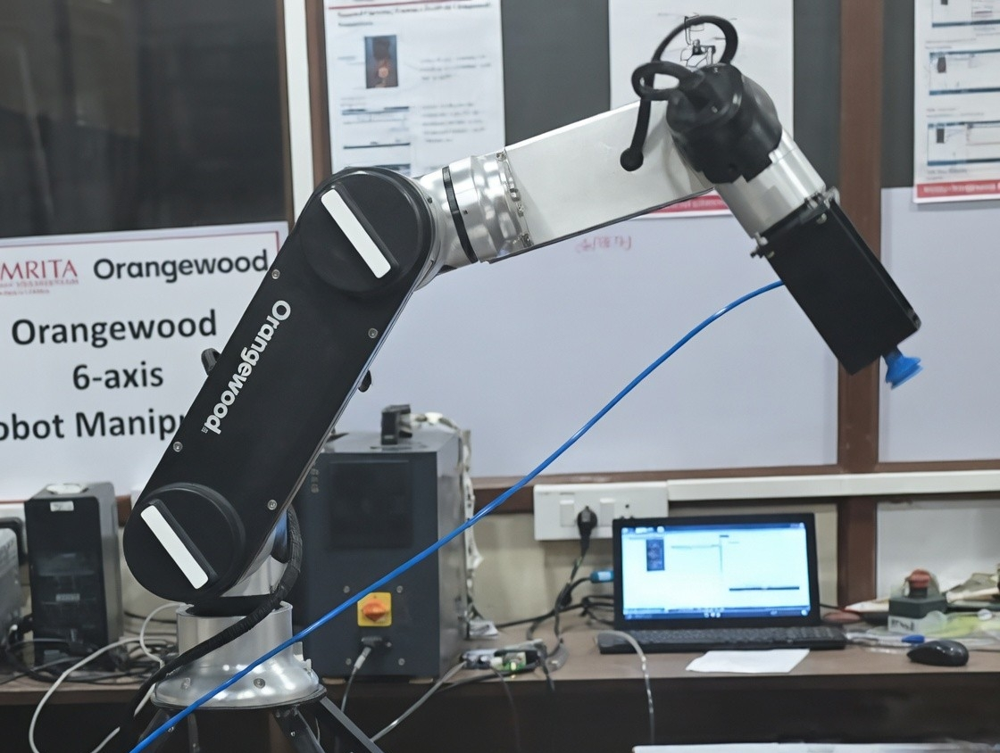
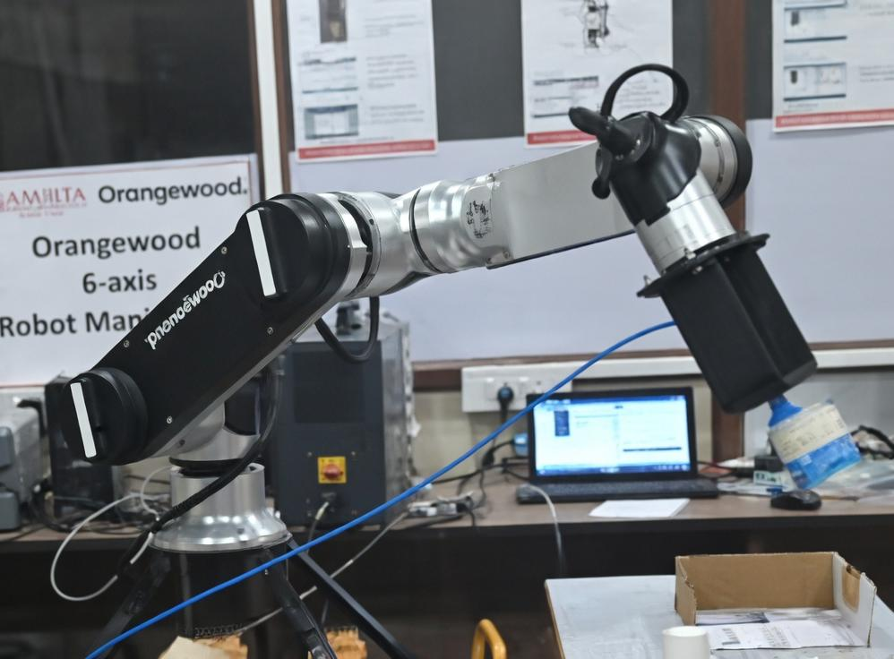
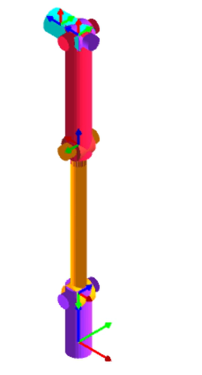
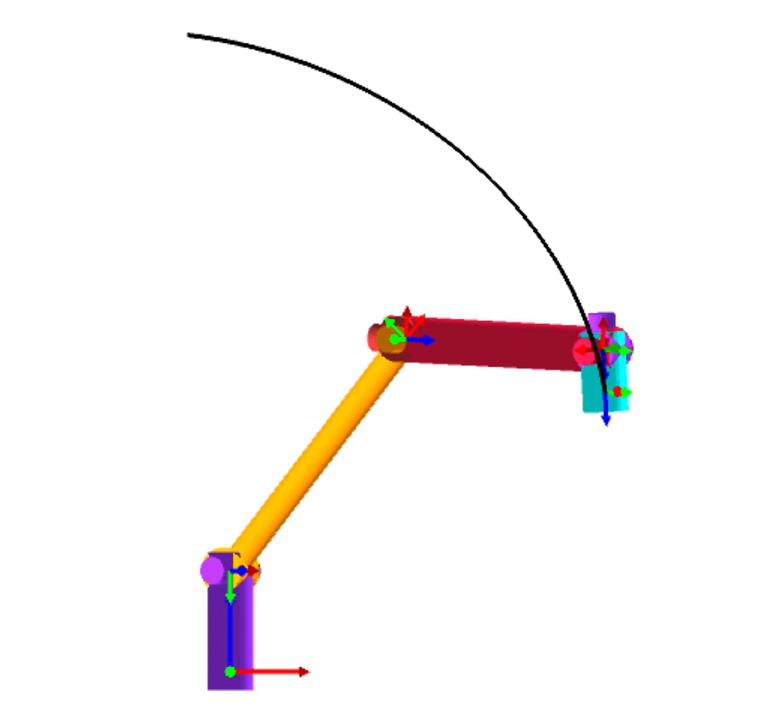

# 🤖 Waste Sorting Robot — Hardware + CoppeliaSim Simulation


> Automated waste sorting and conveyor cleaning workflow — programmed on a real **Orangewood 6-DOF collaborative robot**, then reconstructed as a digital twin in **CoppeliaSim** using the UR5 model.

**Amrita Vishwa Vidyapeetham, Bengaluru — End Semester Robotics Project**

---

## 🎥 Simulation Demo

https://github.com/user-attachments/assets/23290c91-f840-4364-94c4-5888812831d3

---

## ❓ Problem Statement

In real recycling facilities, dust and debris on containers damage downstream processing machines. Manual cleaning is slow and inconsistent. This project automates a **pick → clean → sort** workflow using a 6-DOF collaborative robot on a conveyor line.

---

## 🏗️ System Architecture

```
┌─────────────────────────────────────────────┐
│           TASK CONTROLLER (Lua)             │
│         Threaded child script on UR5        │
└──────────────────┬──────────────────────────┘
                   │ sim.moveToConfig()
         ┌─────────▼──────────┐
         │   UR5 Robot (6DOF)  │  ← Joint-space waypoints
         │  J1→J2→J3→J4→J5→J6 │     measured via Joint Tool
         └─────────┬──────────┘
                   │
      ┌────────────▼────────────┐     ┌─────────────────┐
      │   BaxterVacuumCup (TCP) │────▶│  setObjectParent │
      │      Vacuum Gripper     │     │  attach / detach  │
      └─────────────────────────┘     └─────────────────┘

      ┌─────────────────────────┐
      │    Generic Conveyor     │  ← Programmatic X-axis slide
      │   + belt animation      │    + belt texture via script
      └─────────────────────────┘
```

---

## 🤖 Hardware — Orangewood 6-DOF Manipulator

| Full Lab Setup | Robot in Operation |
|:-:|:-:|
|  |  |

*Orangewood 6-axis Robot Manipulator — Amrita Vishwa Vidyapeetham Robotics Lab*

### Robot + End Effector

| Property | Details |
|----------|---------|
| Model | Orangewood 6-DOF Collaborative Manipulator |
| Joints | 6 revolute: Base → Shoulder → Elbow → Wrist 1 → Wrist 2 → Wrist 3 |
| End Effector | Vacuum suction gripper (electro-pneumatic) |
| Gripper Principle | Compressed air → vacuum generator → suction cup → pressure hold |
| Control Interface | Orangewood GUI (joint space + Cartesian + gravity mode) |
| Operating Speed | ~30% of max — safe observation and debugging |

---

## 📐 Kinematic Analysis — RoboAnalyzer

Before hardware execution, the robot was modeled in **RoboAnalyzer** to study joint structure and validate reachable poses through forward kinematics.

| 6-DOF Robot Structure | Forward Kinematics Result |
|:-:|:-:|
|  |  |

**Forward Kinematics:**
```
Input  : Joint angles θ₁, θ₂, θ₃, θ₄, θ₅, θ₆
Output : End-effector pose (X, Y, Z, Rx, Ry, Rz)
```
Joint values were assigned and FK was computed in RoboAnalyzer to confirm feasible configurations — reducing trial-and-error on the physical robot.

---

## 🔄 Task Workflow

```
[1]  HOME       → Upright safe position
[2]  PICK       → Soda can from dirty input table       [vacuum ON]
[3]  PLACE      → Can on cleaning plate (on conveyor)   [vacuum OFF]
[4]  PICK       → Blower tool from table                [vacuum ON]
[5]  SWEEP      → Blower over can — dust removal motion
[6]  RETURN     → Blower back to original position      [vacuum OFF]
[7]  HOME       → Standby
[8]  CONVEYOR   → Belt moves cleaning plate + can forward
[9]  PICK       → Cleaned can from conveyor end         [vacuum ON]
[10] PLACE      → On final clean output tray            [vacuum OFF]
[11] FINAL HOME → Task complete
```

### Waypoint Teaching
Each pose was taught by **jogging to position and recording joint angles** via CoppeliaSim's Joint Tool — mirroring the teach-pendant workflow on the physical Orangewood robot. Configs are stored in radians and passed directly to `sim.moveToConfig`.

```lua
-- Example: pick soda can
local C_PICK_CAN = {0.20944, -0.184123, 5.201081, 5.942846, -4.745413, 0.846485}
sim.moveToConfig({ joints=jh, targetPos=C_PICK_CAN, maxVel=..., ... })
```

---

## 💻 Simulation — CoppeliaSim (UR5)

The **UR5** was chosen from CoppeliaSim's built-in library as it shares the same 6-DOF serial arm architecture as the Orangewood manipulator.

### Tech Stack

| Tool | Version | Role |
|------|---------|------|
| CoppeliaSim Edu | V4.10.0 | Simulation platform |
| Lua | Threaded script | Robot motion + task logic |
| `sim.moveToConfig` | — | Joint-space motion |
| BaxterVacuumCup | Built-in | Vacuum gripper |
| Generic Conveyor | Built-in | Belt transport |

### Scene Objects

| Simulation Object | Real World Equivalent |
|-------------------|-----------------------|
| UR5 + BaxterVacuumCup | Orangewood robot + vacuum gripper |
| Soda_Can (red cylinder) | Waste soda can |
| Dirty_Table | Input side table |
| Cleaning_Plate | Cleaning surface on conveyor |
| Generic Conveyor Belt | Conveyor system |
| Blower_Tool (gray cylinder) | Paper cup blower |
| Clean_Table + Final_Tray | Output side table |

---

## ▶️ How to Run

**Requirement:** [CoppeliaSim Edu V4.10+](https://www.coppeliarobotics.com/)

```bash
git clone https://github.com/Gurleen121/waste-sorting-robot-simulation.git
```

1. Open CoppeliaSim
2. **File → Open Scene** → `simulation/waste_sorting_scene.ttt`
3. Press **▶ Play**
4. Console prints each step as it executes

> The Lua script is embedded in the `.ttt` file. `waste_sorting_complete.lua` is also provided separately for reference.

---

## 📊 Results

| Aspect | Outcome |
|--------|---------|
| Hardware execution | ✅ Full workflow completed on Orangewood robot |
| Simulation validation | ✅ All 11 steps replicated in CoppeliaSim |
| Gripper reliability | ✅ Consistent pick/place on flat cylindrical surfaces |
| Conveyor | ✅ Automated plate + can transport |
| Hardware–simulation parity | ✅ Identical waypoint teaching approach on both platforms |

---

## 📁 Repository Structure

```
waste-sorting-robot-simulation/
│
├── README.md
├── LICENSE
│
├── simulation/
│   ├── waste_sorting_complete.lua    ← Lua script (all 11 steps)
│   └── waste_sorting_scene.ttt       ← CoppeliaSim scene (open this)
│
├── hardware/
│   └── images/                       ← Real robot experiment photos
│
└── docs/
    ├── methodology.md                ← Full technical methodology
    └── images/                       ← RoboAnalyzer screenshots
```

📄 For full technical details see **[docs/methodology.md](docs/methodology.md)**

---

## 👩‍💻 Author

**Gurleen Kaur Saluja — Amrita Vishwa Vidyapeetham, Bengaluru**

---

## 🙏 Acknowledgements

- [Orangewood Labs](https://www.orangewood.co/) — robot platform
- [CoppeliaSim](https://www.coppeliarobotics.com/) — simulation environment
- [RoboAnalyzer](http://www.roboanalyzer.com/) — kinematic analysis tool

---

## 📄 License

MIT License — see [LICENSE](LICENSE) for details.
